[](https://github.com/kotekpsotek/svelte-chat)
[](https://github.com/kotekpsotek/svelte-chat)
[](https://github.com/kotekpsotek/svelte-chat)


# Svelte-Chat
The complex chat solution for modern applications

## Swift description
Designed for **SvelteKit applications** chat which offers your clients top-level chat experiences and full power to administrate for your management team

## Installation (as always - for npm)
```bash
$ npm i svelte-chat
```

### Overview:
<details>
    <summary>
        <b>Expandable - open to see</b>
    </summary>
    <h3><b>For clients app</b></h3>
    <ul>
        <li>Chat interaction on page content background</li>
        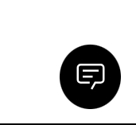
        <li>Empty Chat List</li>
        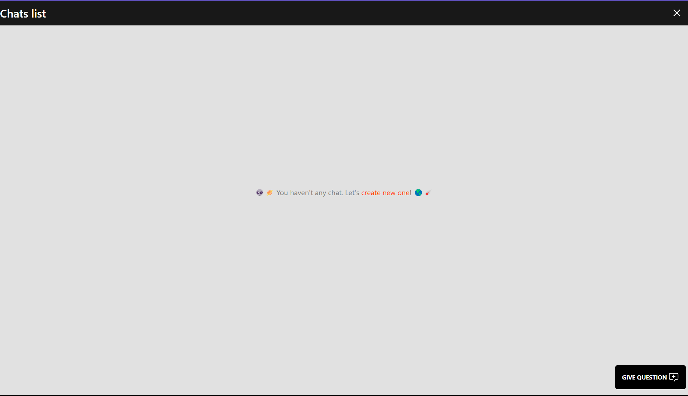
        <li>Chat lists with some</li>
        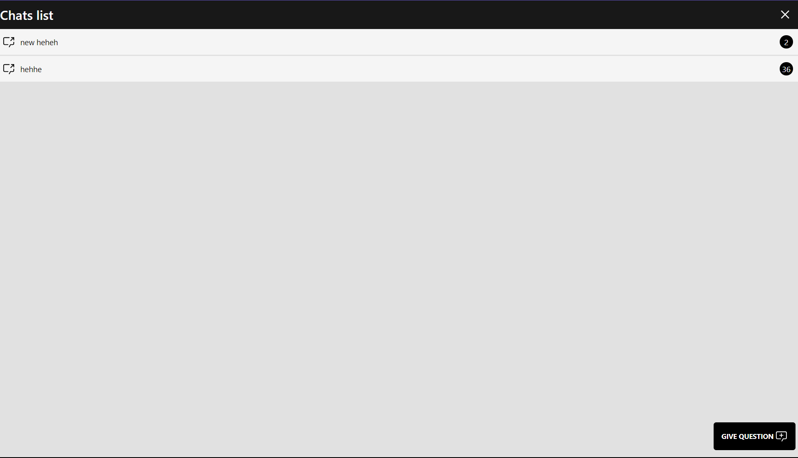
        <li>Particular selected chat</li>
        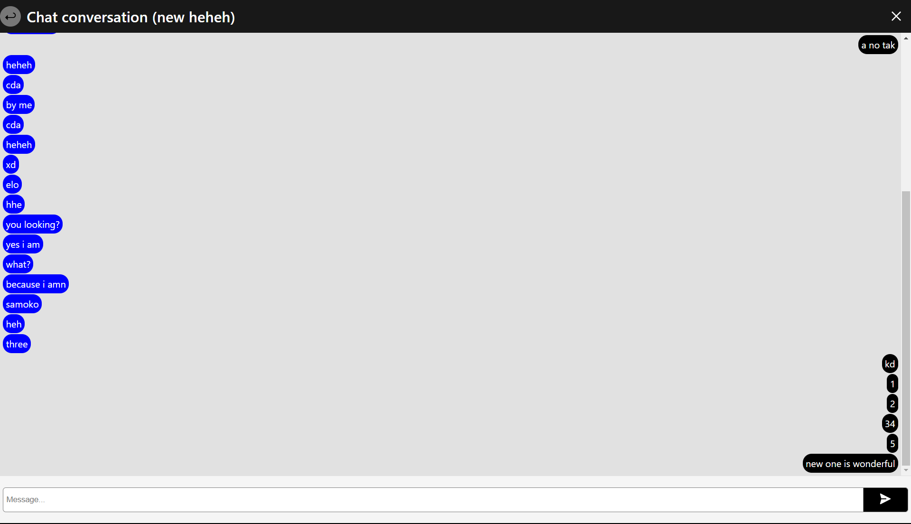
    </ul>
    <br>
    <h3><b>For admins app</b></h3>
    <ul>
        <li>Activiteies required to be an admin and stop</li>
        <ul>
            <li>Signup</li>
            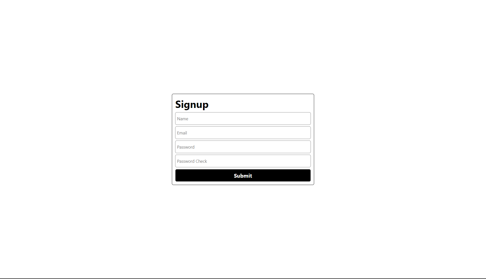
            <li>Signin</li>
            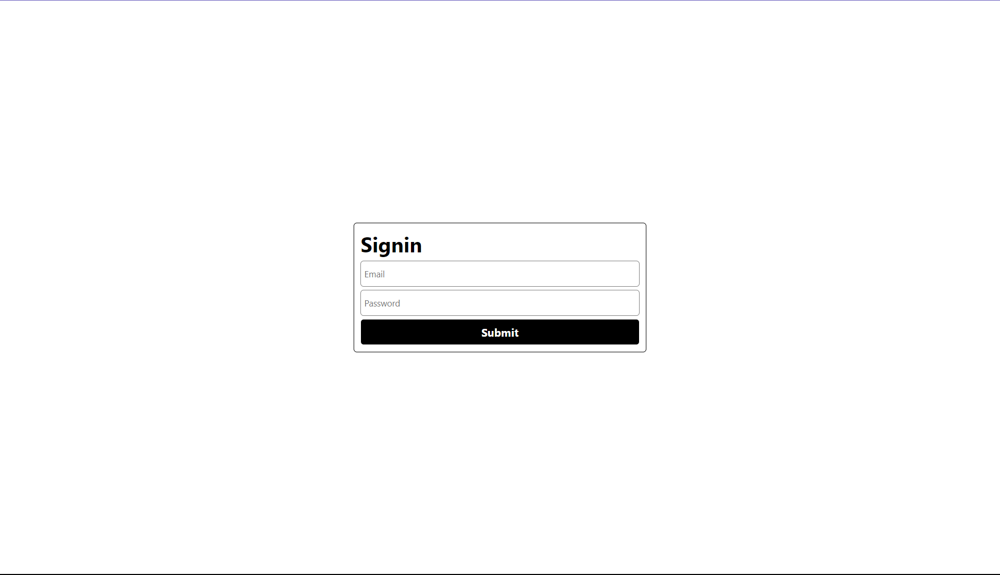
            <li>Logout</li>
            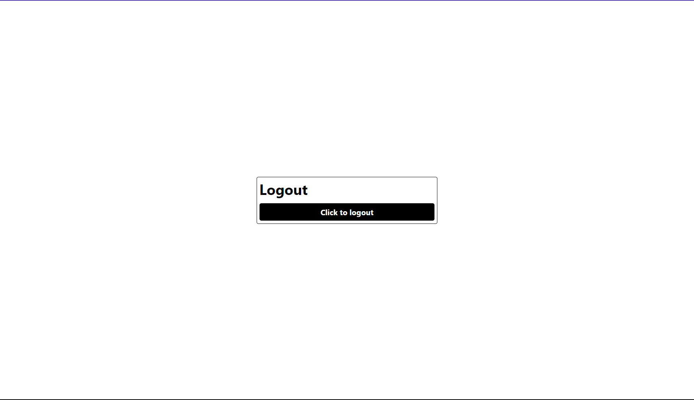
        </ul>
        <li>Admin Panel</li>
        <ul>
            <li>Empty one</li>
            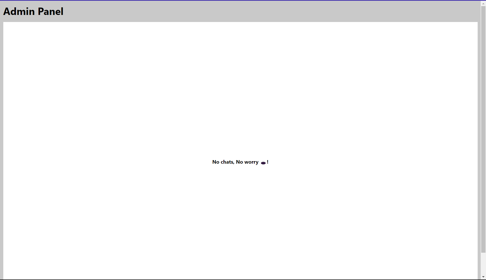
            <li>One with open cases</li>
            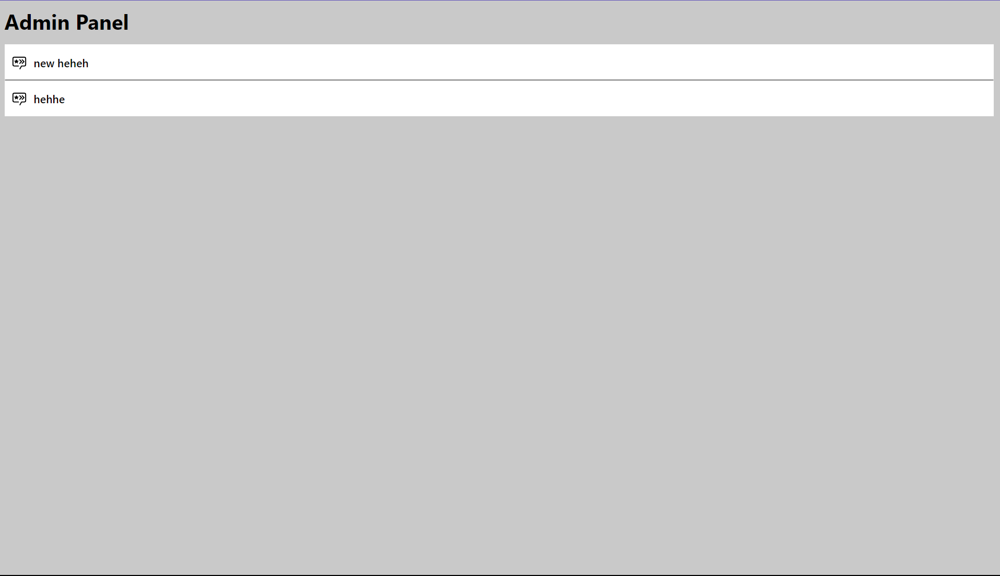
        </ul>
        <li>Chat conversation</li>
        <ul>
            <li>Messages and task/send-bar</li>
            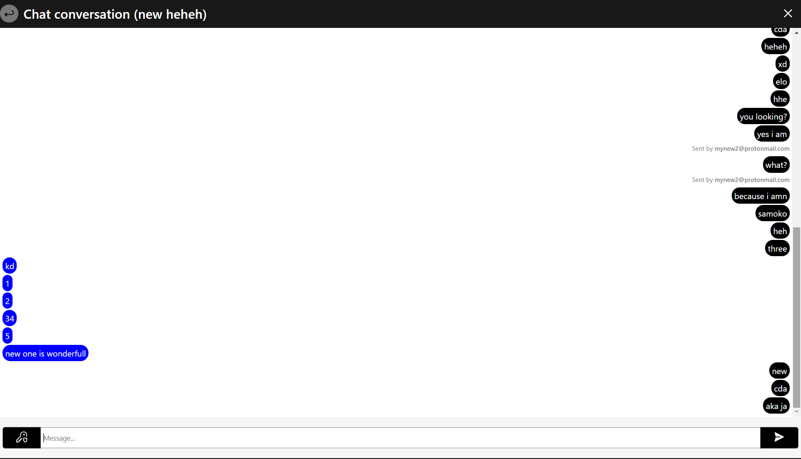
            <li>Chat Management Menu</li>
            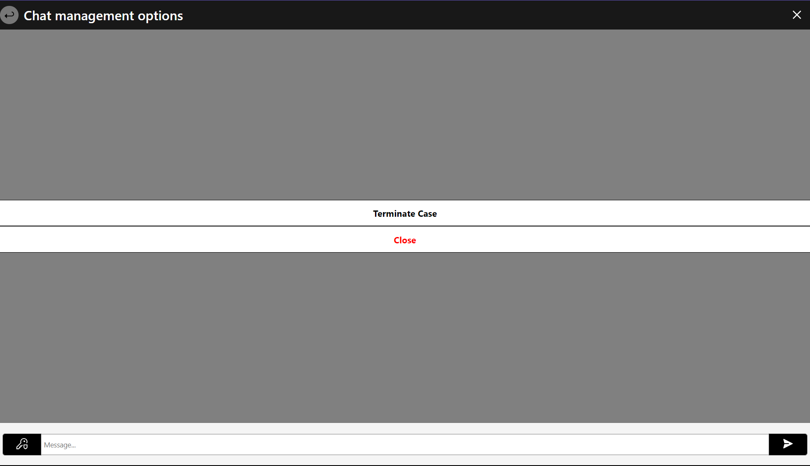
        </ul>
    </ul>
</details>

## **Three to use steps - is really straight forward**
***1st:*** Use **svelteChatPlugin** which embedds all source functionalities (with administration included)
```typescript
// vite.config.{js,ts}
import { sveltekit } from '@sveltejs/kit/vite';
import { defineConfig } from 'vite';
// Import plugin from module
import { svelteChatPlugin } from "svelte-chat"

export default defineConfig({
	plugins: [sveltekit(), svelteChatPlugin()]
});
```

***2nd:*** Attach client interaction button to your SvelteKit App. Like below or similary:
```svelte
// Route: /src/routes/+layout.svelte
<script>
    import { SvelteChatButton } from "svelte-chat";
</script>

</slot>
<SvelteChatButton/>
```

***3rd:*** Connect configuration with your client-side app. This can be done generally by 2 ways:
1. Use our load function which pass all configuration for client side by itself:
<!-- (for my the simplest one) -->
```TypeScript
// This can be any server side SvelteKit load spot file like: +layout.server.ts located in scope where 'SvelteChatButton' is used
// -> 1st: When you just made +layout.server.ts/+page.server.ts file
import { svelteLoadLayout } from "svelte-chat";

// This load automatically
export const load = svelteLoadLayout;

// -> 2nd: When you already have +layout.server.ts/+page.server.ts file
import { svelteLoadLayout } from "svelte-chat";

// This load autmoatically
export const load = () => {
    const math = 1 * 1 * 0;

    return {
        ...svelteLoadLayout()
        math,
    }
}
```

2. Enter configuration to ```<SvelteChatButton/>``` initialization component target:

```HTML
<script>
    import { SvelteChatButton } from "svelte-chat";
</script>

</slot>

<!-- Port 10501 is a default port for server communication. When you setup other port, pass here -->
<SvelteChatButton lexConfig={{port: 10501}}/>
```

- As you saw this is not to far complicated. But you should be couscious side effects which happens here:
    - When you skip any step application won't be work
    - In ***1st*** config option from **3rd** step, default config is load automatically same as fine tuned user configuration <u>[more about bellow]</u>
    - In ***2nd*** config option from **3rd** step, when you pass wrong port you will see an error into client side Debug Tool, so you must match-up correctly

<h5>Congrats. You have got configured basically your <u>svelte-chat</u></h5>

## Fine grainded configuration
Fine grained configuartion covers for moment ports configuration for: **basic**, **admin** apps and all these ***optionally*** and ***separately***.<br/>
Config you pass as JSON content for your Device Environment Variables.<br/><br/>
**Configuration JSON Overlay:**
```JSON
{
    /* Admin app - Where serves app under whose you can manage clien cases */
    "admin_server": {
        "port": 10502
    },
    /* App communcation - so where your client-side will be call, to get and send informations */
    "server": {
        "port": 10501
    }
}
```

**As Device ENV "***SVELTE_CHAT***":**<br/>
Ok, So when we defined what you can configure, to make this work and <u>***end fine-grained configuration***</u> you must pass such short config to device environment varaible ***SVELTE_CHAT***


## Other worth informations
1. Default Admin App port is **10502**,
2. Default App communcation port is **10501**,
3. Server side work as a vite plugin,
4. To store all datas we use **MongoDB** local database on default port **27017**
<!-- 4. Default database is MongoDB and you should have it on your local machine port 27017 -->

## Contribution:
**You feel will to help in solution evolution.** Don't be shy and pull issue with demand like: I would like take the participation in evolution because ...[cause]

## License
All what you should know about Copyrights is that all code base is under <u>GPLv3</u>

<h3 align="center">Made with ❤️ by <b><a href="https://github.com/kotekpsotek">kotekpsotek</a></b></h3>
